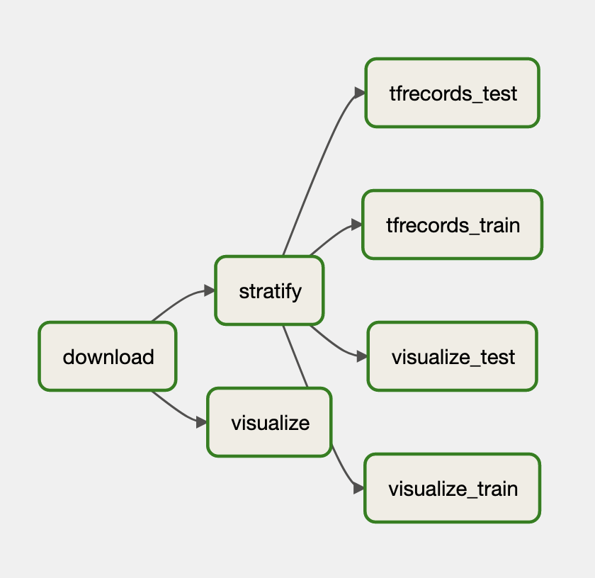

# Simple Airflow App

This repository consists of application to simulate dataset download, visualizaion, straifies and creates tfrecords

## Install Dependencies

```shell
pip install -r requirements.txt
```

## Running individual shell scripts 
You can run the shell scripts where output of modules are dependant on others
```shell
 python download.py --dataset_folder=./ 
 python visualize.py --input_txt_file=./download.txt
 python stratifier.py --input_txt_file=./download.txt 
 python prepare_tfrecords.py --input_txt_file=./download.txt --output_tfrecord_path="./record.tfrecord" 
```

## Set up Airflow
### First time set up
```shell
export AIRFLOW_HOME="$(pwd)"
airflow db init
airflow users  create --role Admin --username admin --email admin --firstname admin --lastname admin --password admin # Creating admin username and admin password
```

### Airflow Env Setup
1. Run Airlflow Scheduler on this repo
```shell
export AIRFLOW_HOME="$(pwd)"
airflow scheduler
```
2. Run Airflow Webserver on this repo
```shell
export AIRFLOW_HOME="$(pwd)"
airflow webserver --port=8080
```

### Steps for running the dag
1. Open http://localhost:8080 to access airflow UI
2. Set dataset_folder variable in airflow admin variables list( Say, /Users/srirama/Dev/simple_airflow_app/dataset)
3. Trigger DAG run with config like this
```json
{
  "train.output_tfrecord_path": "/Users/srirama/Dev/simple_airflow_app/dataset/train.tfrecord",
  "test.output_tfrecord_path": "/Users/srirama/Dev/simple_airflow_app/dataset/test.tfrecord"
}
```


The entire DAG looks like this 


<br/>

